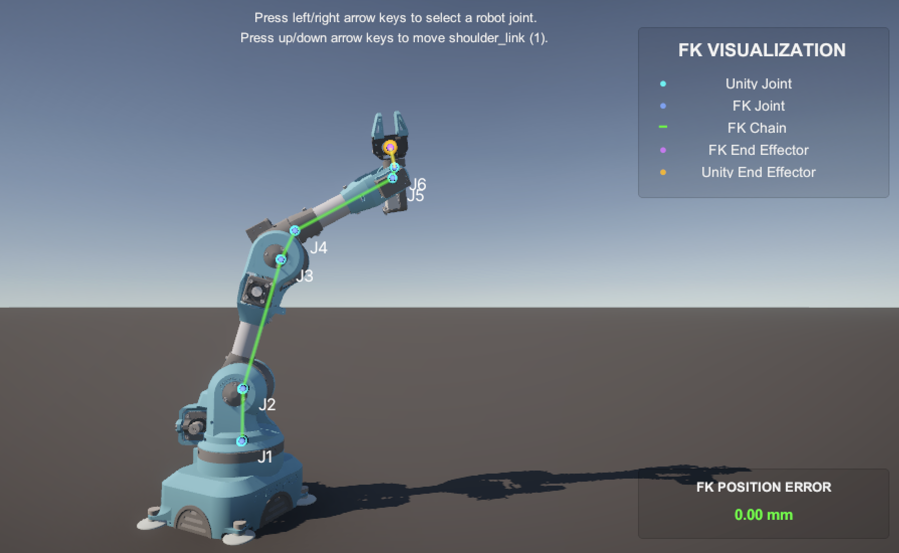

# Robot Forward Kinematics Visualization

A Unity-based robotics simulation project for implementing and
validating **forward kinematics (FK)** on a 6-DOF articulated robot.

The project uses Unity's `ArticulationBody` system as the robot model
and independently calculates the end-effector position from the joint
angles. The calculated FK result is visualized against Unity's actual
transforms for validation.

# Robot Forward Kinematics Visualization

A Unity-based robotics simulation project for implementing and validating
forward kinematics (FK) on a 6-DOF articulated robot.



## Current Status

### Forward Kinematics (Complete)

-   6-DOF robot articulation configured in Unity.
-   Joint angles read from Unity `ArticulationBody` components.
-   Zero-pose joint relationships captured at startup.
-   FK reconstructs the joint chain from the recorded geometry and
    current joint angles.
-   FK end-effector position calculated independently.
-   FK position compared with Unity's actual end-effector position.
-   Position error calculated and displayed in millimeters.
-   Calculated and actual kinematic chains visualized in the Unity
    scene.
-   Joint labels `J1`--`J6` displayed for inspection.

## Kinematic Chain

``` text
J1 → J2 → J3 → J4 → J5 → J6 → End Effector
```

For each consecutive pair of joints, the implementation stores the
zero-pose position offset and relative rotation. The end-effector offset
and rotation relative to J6 are also captured.

At runtime, the current joint angles are read and applied sequentially
to reconstruct the FK chain.

## Validation

The independently calculated FK end-effector position is compared with
Unity's actual end-effector transform:

``` text
Position Error = distance(FK position, Unity position)
```

The current validation can reach a displayed error of:

``` text
0.00 mm
```

This indicates that the FK calculation matches Unity's end-effector
position within the displayed precision.

## Controls

-   **Left / Right Arrow** --- select a robot joint.
-   **Up / Down Arrow** --- move the selected joint.

Joint motion and FK validation update in real time.

## Main Component

### `ForwardKinematics.cs`

Responsible for:

-   Capturing the zero-pose kinematic structure.
-   Reading current joint angles.
-   Calculating FK joint positions.
-   Calculating the FK end-effector position.
-   Comparing FK and Unity positions.
-   Drawing FK and Unity visualization elements.

## FK Procedure

``` text
Capture zero pose
       ↓
Store joint/link relationships
       ↓
Read current joint angles
       ↓
Apply joint rotations sequentially
       ↓
Transform link offsets
       ↓
Reconstruct J1 → J6
       ↓
Calculate FK end effector
       ↓
Compare against Unity EE
       ↓
Display position error
```

## Why Separate FK From Unity?

Unity already provides the robot's articulated motion. The purpose of
this implementation is therefore not simply to read Unity's final
end-effector position.

Instead, the project maintains a separate FK calculation that
reconstructs the robot pose from joint angles and the captured kinematic
structure. This makes it possible to validate the mathematical model
against the simulation.

## Future Direction

The next major step is **inverse kinematics (IK)**.

A planned interaction is to obtain a 3D target position from computer
vision---for example, using a laptop camera and hand tracking---and
provide that target to an IK solver.

``` text
Camera
  ↓
Computer Vision
  ↓
3D Target Position
  ↓
Inverse Kinematics
  ↓
Joint Angles
  ↓
Unity Robot
  ↓
Forward Kinematics Validation
```

This can later be extended toward trajectory generation and robot motion
planning.

## Tech Stack

-   Unity
-   C#
-   Unity `ArticulationBody`
-   Forward Kinematics
-   3D robotics simulation
-   Unity Gizmos / Editor Handles

## Development Notes

The current implementation focuses on **position FK validation**.
Orientation validation and full end-effector pose comparison can be
added later if needed.

The FK visualization is primarily a development and validation tool: it
exposes both the physical Unity joint positions and the independently
reconstructed FK positions so discrepancies can be inspected visually
and numerically.
